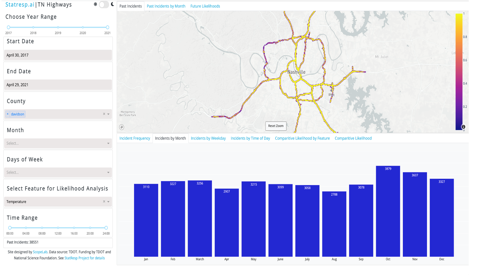

# Incident-dashboard

If you do not have this environment then create it. To run just follow the instructions based on docker as described  below.

## Running app with Docker

```
docker build -t tdotdash .
docker run --memory='4g' --rm -p 8080:8080 tdotdash
```

Note we give 4 gigabyte to this. Make sure your docker dashboard has enough resources enabled. 

Go to your browser and open http://127.0.0.1:8080. It should look like below.



# Authentication Changes/Notes
- Flask server running
- Dash piggybacking as a module
- Pass Flask app server into create_dashboard()
- Allows Dash to use own Flask instance instead of its own

Todo:
- Create roles for users
- Allow admin role to add users to whitelist
- Only allow whitelisted google authorized users access to dashboard
- Incorporate other authorizations (e.g. OICD, ...) 
